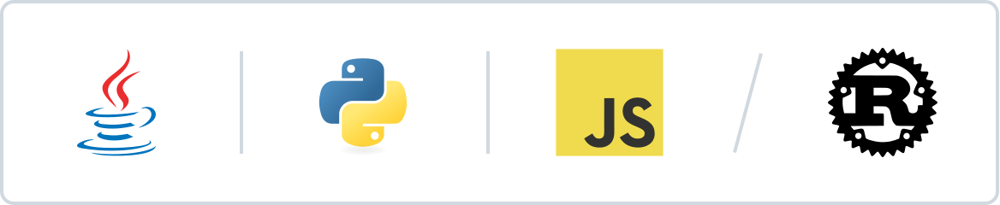

<h2 align="center">🚀 About</h2>

  <b>Software Engineer</b> focused on building fast, reliable software. 
  I care about <b>clean architecture</b>, <b>meaningful performance</b>, and <b>open source</b>. 
  Currently diving deep into <b>systems programming</b> and the <b>Rust</b> ecosystem, 
  without leaving my <b>Java</b> roots behind.

   
  <picture>
    <source media="(prefers-color-scheme: dark)" srcset="./assets/stack-dark.svg">
    <source media="(prefers-color-scheme: light)" srcset="./assets/stack-light.svg">
    
  </picture>

